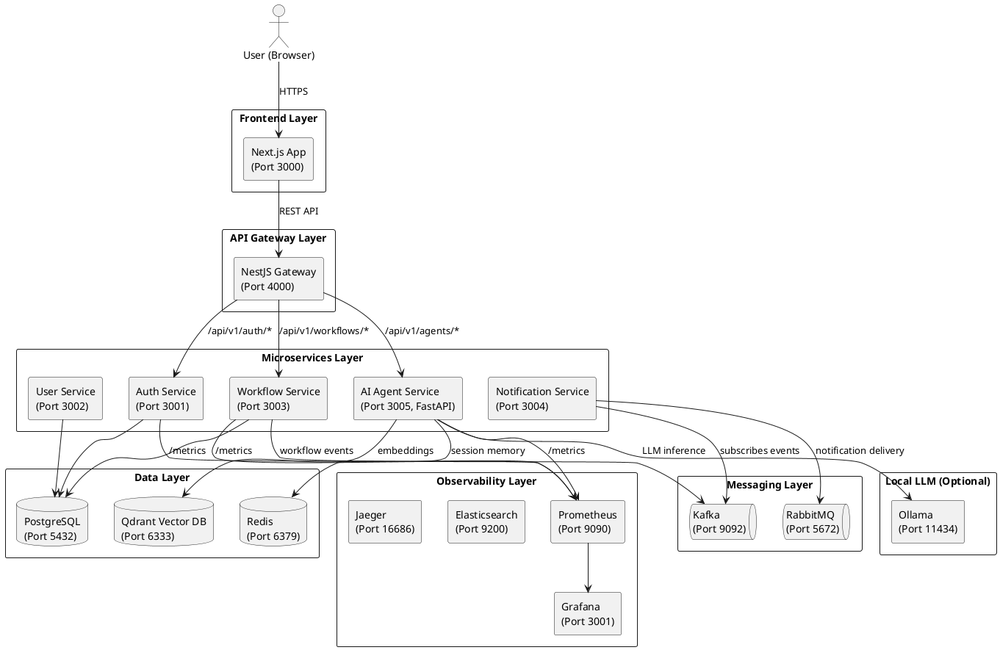

# Quorvexa — System Design

## Architecture Overview

Quorvexa is a microservices-based SaaS platform built around three core principles: **offline-first**, **observable-by-default**, and **AI-native**. Every architectural decision is made to allow the system to run locally with a single command while scaling to hundreds of thousands of users in production.

---

## Architecture Diagram (PlantUML)



---

## Data Flow: Workflow Execution

```
User → [POST /api/v1/workflows/:id/trigger]
     → Gateway (validates JWT, rate limit)
     → Workflow Service (loads workflow, validates active status)
     → WorkflowRunService.execute()
       → For each step (ordered):
         → ACTION: execute business logic
         → AI_AGENT: POST to ai-agent-service
           → AgentService.run()
             → LangChain creates agent with tools
             → Ollama/OpenAI generates response
             → Tool calls if needed
           → Returns output to context
         → HTTP_REQUEST: external API call
         → NOTIFICATION: POST to notification-service
         → Store step result in PostgreSQL
       → Emit workflow.completed event to Kafka
     → Return WorkflowRunResult to client
     → SSE stream sends real-time update to browser
```

---

## Trade-offs

### 1. SSE vs WebSockets

**Chosen**: SSE (Server-Sent Events)

| Factor | SSE | WebSocket |
|--------|-----|-----------|
| Complexity | Low (HTTP/1.1) | High (WS protocol) |
| Scaling | HTTP load balancers work | Requires sticky sessions |
| Firewall compatibility | HTTP — no issues | Often blocked |
| Bidirectional | No (workaround: REST for up) | Yes |
| Browser support | Universal | Universal |

**Decision**: Workflow execution produces server-to-client events. Clients trigger actions via REST POST. SSE handles the notification path cleanly. If bidirectional real-time is needed (e.g., live collaboration editing), WebSocket can be added as a fallback layer.

### 2. Microservices vs Monolith

**Chosen**: Microservices

- **Why**: Each service has a different scaling profile. Auth service needs horizontal scaling for login spikes. AI service needs GPU resources. Workflow service needs high CPU.
- **Cost**: Operational complexity. Mitigated by: single Docker Compose for local, Helm charts for K8s.
- **Alternative**: A modular monolith would have been simpler early-on. We chose microservices because the spec requires it and because the AI service (Python/FastAPI) naturally separates from Node.js services.

### 3. LangChain vs Direct LLM API

**Chosen**: LangChain

- **Why**: Agent orchestration, tool calling, memory management, and prompt pipelines are all solved problems in LangChain. Building this from scratch would add months.
- **Cost**: LangChain abstractions can hide behavior. We mitigate by logging all intermediate steps.

### 4. PostgreSQL vs NoSQL

**Chosen**: PostgreSQL for OLTP

- **Why**: Workflows, users, and audit logs are relational data with complex queries. ACID compliance is critical for financial-grade audit trails.
- **Vector DB (Qdrant)**: Used for semantic search and AI memory — purpose-built for embeddings, not a replacement for relational data.

---

## Scaling Strategy

### Horizontal scaling (stateless services)

All NestJS services are stateless. Authentication state lives in JWT (self-contained) + Redis (refresh token tracking). Scale by adding replicas.

### Database scaling

- **Read replicas**: PostgreSQL read replicas for analytics queries
- **Connection pooling**: PgBouncer between services and Postgres
- **Partitioning**: Workflow runs table partitioned by `created_at` for performance

### AI service scaling

- **Ollama**: Single GPU node in local mode. In production, use multiple GPU nodes with round-robin load balancing.
- **Request queuing**: Redis queue in front of AI service to absorb spikes without overloading the LLM.
- **Response caching**: Identical prompts with same config are cached in Redis for 1 hour.

---

## Security Design

### Authentication flow

```
1. POST /auth/login → Local strategy validates password (argon2id)
2. Issues: access token (15min JWT) + refresh token (7-day UUID, stored as argon2 hash)
3. Client sends access token as Bearer on every request
4. Gateway validates JWT, extracts tenantId, userId, role
5. Services trust the gateway — no re-validation needed
6. On 401: client uses refresh token to get new pair (token rotation)
```

### Multi-tenancy

Every database table has a `tenantId` column indexed. Every service query filters by `tenantId` extracted from the JWT. No data can leak between tenants at the application layer. Row-level security (RLS) in PostgreSQL provides a second layer.

### RBAC

| Role | Capabilities |
|------|-------------|
| super_admin | All actions, all tenants |
| admin | All actions within their tenant |
| member | Create/edit their own workflows and tasks |
| viewer | Read-only access |
